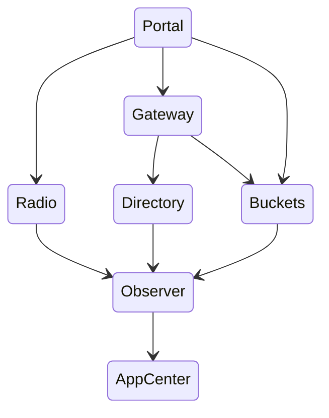
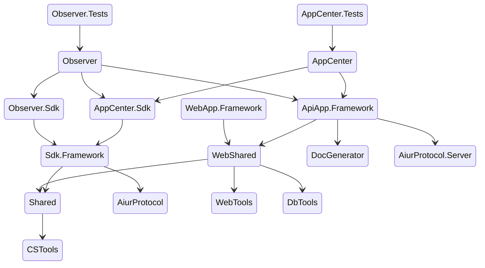

# 进程依赖顺序

## 项目代码依赖关系

## 开发顺序

1. AppCenter (API App)
2. Observer (API App)
3. Buckets (API App)
4. Directory (API App)
5. Radio (API App)
6. Gateway (Human App)
7. Portal (Human App)

## 可以后续额外提供的服务

1. FRP 云
2. 短链接
3. 云存储
4. 消息推送
5. 健康监控
6. 配置中心
7. 虚拟机
8. 容器
9. 反向代理
10. AiurVersionControl
11. GLM
12. 翻译 API
13. 云数据库
14. 云函数
15. 