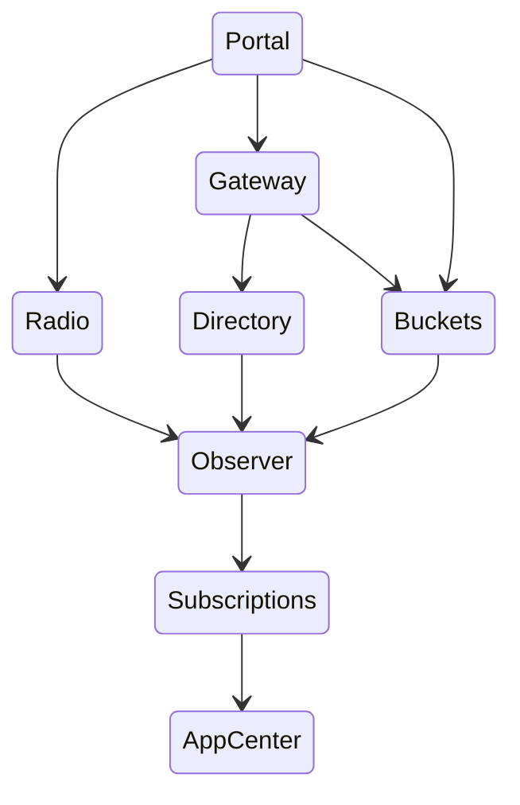
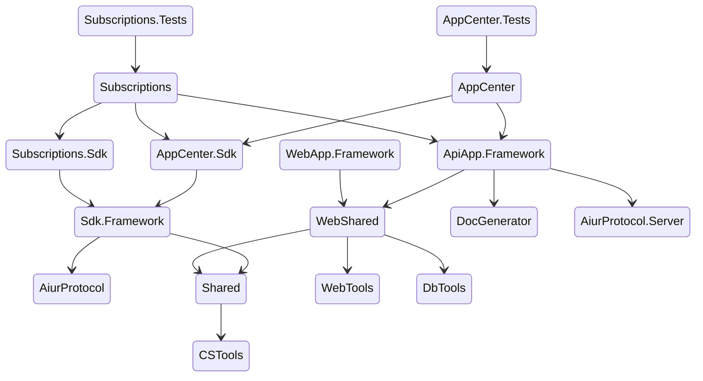

# 进程依赖顺序

## 项目代码依赖关系

## 开发顺序

1. AppCenter (API App)
2. Subscriptions (API App)
3. Observer (API App)
4. Buckets (API App)
5. Directory (API App)
6. Radio (API App)
7. Gateway (Human App)
8. Portal (Human App)

## 可以后续额外提供的服务

1. FRP 云
2. 短链接
3. 云存储
4. 消息推送
5. 健康监控
6. 配置中心
7. 虚拟机
8. 容器
9. 反向代理
10. AiurVersionControl
11. GLM
12. 翻译 API
13. 云数据库
14. 云函数
15. 