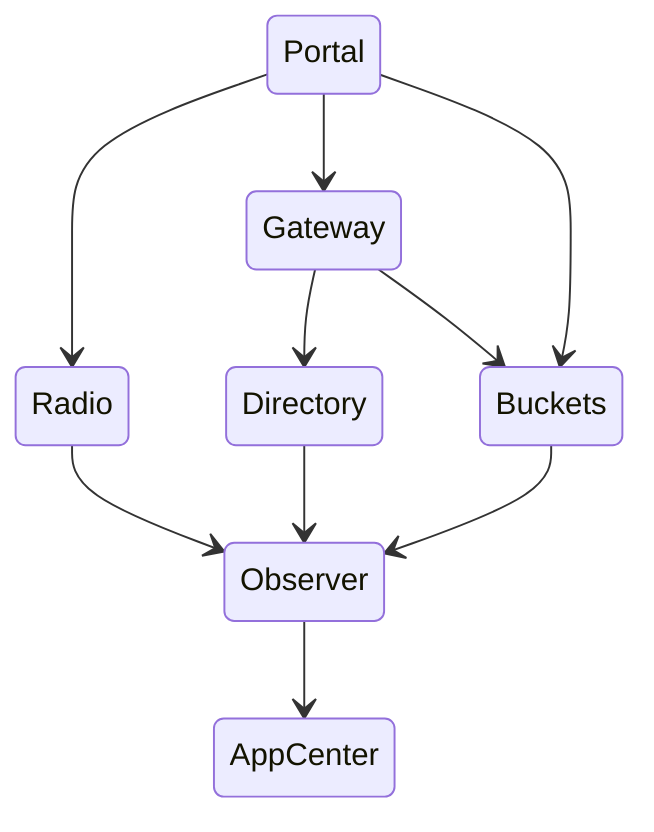

# Structure

```mermaid
stateDiagram-v2
    Portal --> Gateway
    Gateway --> Buckets
    Gateway --> Directory
    Radio --> Observer
    Portal --> Radio
    Portal --> Buckets
    Observer --> AppCenter
    Directory --> Observer
    Buckets --> Observer
```

## 开发顺序

1. AppCenter (API App)
2. Observer (API App)
3. Directory (API App)
4. Buckets (API App)
5. Radio (API App)
6. Gateway (Human App)
7. Portal (Human App)
